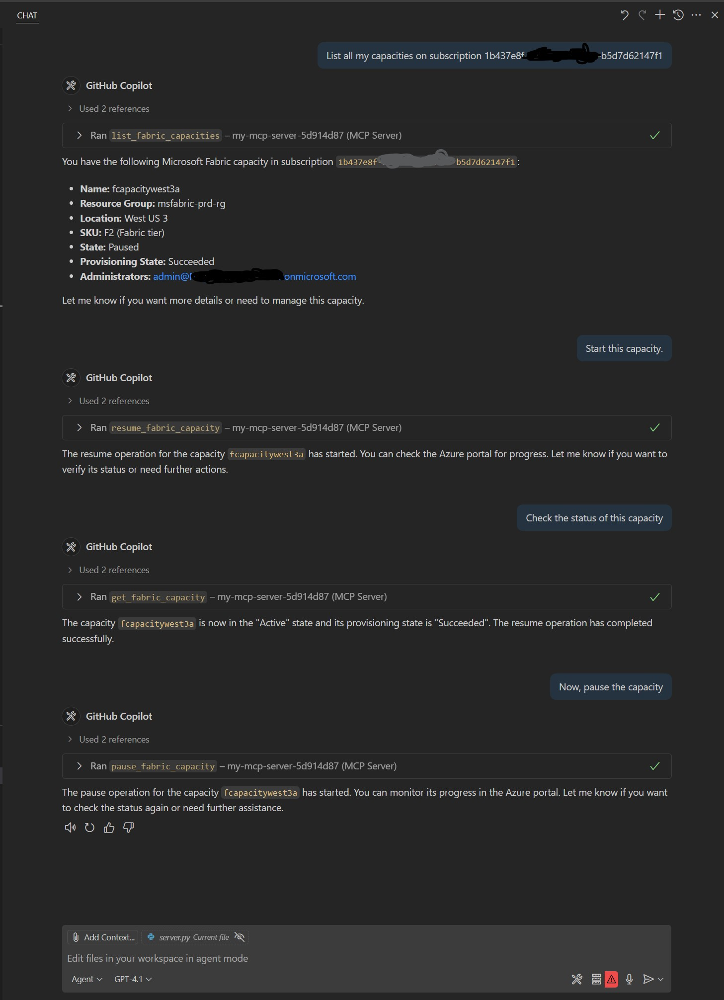

# Fabric Admin MCP Server

An open-source MCP server to perform operations on Microsoft Fabric, like administration and management of Fabric capacities. At this moment, this repo has an initial set of tools to manage Capacities, but it will be expanded to further support additional tools and Fabric administration workloads.

## ✨ Features 
- Exposes Fabric admin operations as MCP tools;
- Uses secure, yet flexible, authentication mechanisms for Azure and Fabric, like Service Principal and Managed Identities;
- FastAPI + FastMCP for a modern, async, extensible backend;

## 🤖 Interacting with the MCP Server

You can use any MCP Client to interact with this MCP server. Below, is a sample showing how to interact with it using GitHub Copilot on VSCode as a MCP Client:



This example demonstrates how the MCP tools are exposed and can be accessed for managing Microsoft Fabric resources.

## 🗂️ Project Structure

- `server.py` — Main entry point to start the MCP server
- `common.py` — Shared utilities and logging
- `src/capacity/` — Logic to interact with Fabric and expose then as MCP tools
- `requirements.txt` — Python dependencies

## ⚡ Quickstart

1. **Install dependencies:**
   ```sh
   pip install -r requirements.txt
   ```

2. **Set up authentication:**
   - The server uses `DefaultAzureCredential` for secure Azure API access.
   - You can authenticate using:
     - **Azure CLI:** Run `az login` in your terminal.
     - **Managed Identity:** If running in Azure, ensure the managed identity has the required permissions.
     - **Service Principal:** Create a `.env` file in the project root with applicable variables (see "Using a Service Principal for Authentication" section below for details).

3. **Run the MCP server locally:**
   ```sh
   python server.py
   ```

## Running the MCP Server in Docker (locally)

1. **Prepare your environment variables:**
   - Copy `env.example` to `.env` and fill in your Azure credentials.

2. **Build the Docker image:**
   ```bash
   docker build -t fabric-admin-mcp .
   ```

3. **Run the Docker container:**
   ```bash
   docker run --env-file .env -p 8000:8000 fabric-admin-mcp
   ```

4. **Access the MCP server:**
   - The server will start at [http://127.0.0.1:8000/mcp/](http://127.0.0.1:8000/mcp/).

4. **Test with VS Code as a Client:**
   - Open the Command Palette (`Ctrl+Shift+P`), search for "MCP: Connect to Server", and enter `http://127.0.0.1:8000/mcp/` (change the address if running it remotely).
   - You can now use MCP tools exposed by this server directly from VS Code using Agent Mode.

## 📦 Requirements

- Python 3.8+;
- Azure credentials with proper access to the backend (Azure/Fabric admin)/

### 🔐 Using a Service Principal for Authentication

1. **Create a Service Principal** (if you don't have one):
   ```sh
   az ad sp create-for-rbac --name <your-app-name> --role Contributor --scopes /subscriptions/<your-subscription-id>
   ```
   Note the `appId` (Client ID), `tenant`, and `password` (Client Secret) from the output.

2. **Create a `.env` file in the project root:**
   Copy `.env.example` to `.env` and fill in your values:
   ```env
   AZURE_CLIENT_ID=your-service-principal-client-id
   AZURE_TENANT_ID=your-tenant-id
   AZURE_CLIENT_SECRET=your-service-principal-client-secret
   ```

3. **Authorize the Service Principal:**
   Ensure the Service Principal has appropriate permissions. For example, at least `Contributor` at subscription or Resource Group level to manage Fabric Capacities. Additional Admin API access will be required for additional tools yet to be developed.

4. **Run the server:**
   The server will automatically use these credentials for authentication via `DefaultAzureCredential`. 

## 🚀 Future Improvements
- Add option to deploy as a Docker image.
- Add option to deploy as an Azure Function.
- Add tools for additional Fabric management operations, such as Workspace management and reviewing capacity settings.
- Improve documentation and provide more usage examples.
- Add automated tests and CI/CD pipeline for deployments.
